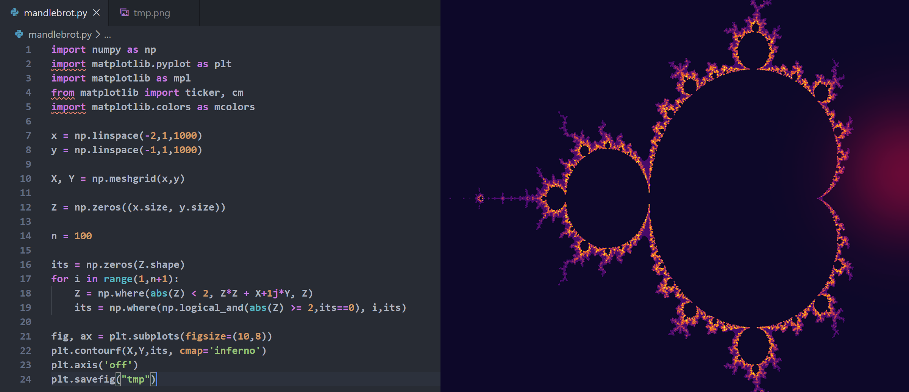

---
# Feel free to add content and custom Front Matter to this file.
# To modify the layout, see https://jekyllrb.com/docs/themes/#overriding-theme-defaults

layout: home
title: About
---

Welcome to my portfolio! My name is Isaac Bromley-Dulfano (he/him), and I'm a third year undergraduate studying electrical engineering at the University of Michigan.

Over the last three years, I've discovered growing passions for renewable energy, embedded systems, and the intersection between engineering, art, and community. I hope this website offers additional perspective on the work I've done and the interests that I have. 

Thanks,
Isaac

 

 
